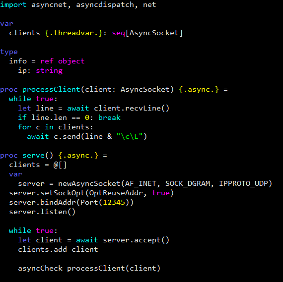

# Nanorc for Nim
A Nano editor syntax hightlight for the Nim programming language

## Installation
to make use of this file\
simply download and place the file in the local ~/.nano/ directory for **single user** configuration
 
`# wget https://raw.githubusercontent.com/777shuang/nanorc-nim/master/nim.nanorc -O /usr/share/nano/nim.nanorc`

## Examples
here's an example of the highlighted syntax
 
 

## Info
Pull requests and issues are welcomed!
